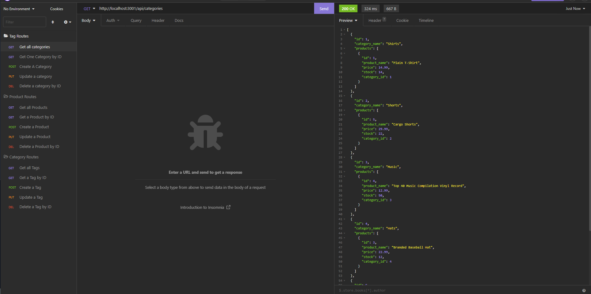

# dude, Where is my stuff??

## License

https://opensource.org/licenses/Apache-2.0

[Youtube Walkthrough Video](https://youtu.be/VP6eIfS0lp0)

## Table of contents

- [Description](#description)
- [Installation](#installation)
- [Usage](#usage)
- [Contribution Guidelines](#contribution-guidelines)
- [Test](#test)
- [Questions](#questions)
  - [GitHub](#github)
  - [email](#email)

## Description

This is an application that functions as the back end for an E-Commerce website using API Routes that perform CRUD operations

## Installation

Fork or download the application, run the schema, seed the database and start the server

## Usage

This is used to keep track of any items you might have in an e-commerce site. It helps you keep track of inventory and prices

## Contribution Guidelines

Git in touch with me!

## Test

N/A

## Questions

### [norher](https://github.com/norher)

### normanh.dev@gmail.com
